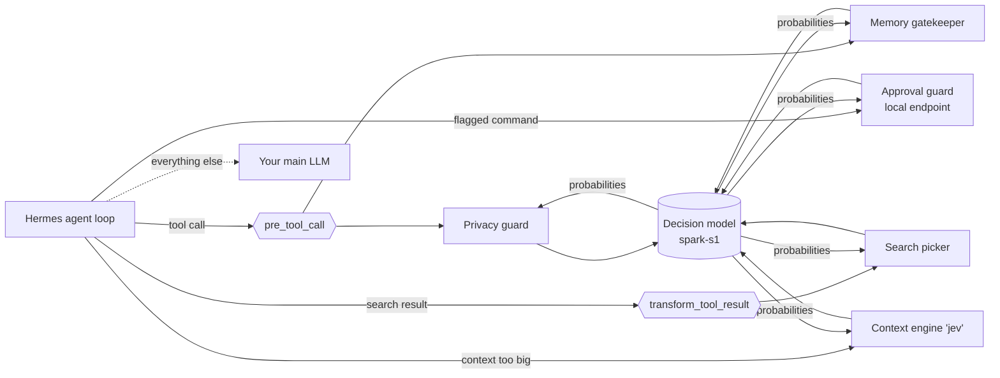

<div align="center">

# jevcontrol-hermes

**A fast reflex layer for [Hermes Agent](https://github.com/NousResearch/hermes-agent).**
A small decision model handles the many tiny, pick-one decisions an agent makes, so your big model only does the thinking.


[Quick start](#quick-start) · [What you get](#what-you-get) · [How it works](#how-it-works) · [Results](#results) · [Troubleshooting](#troubleshooting) · [Credits](#credits)

</div>

---

An agent loop is full of small questions: *Is this search about to leak a password? Is this memory note worth keeping?
Which of these eight search results matter? Is this `rm -rf` safe?* Asking a 27B model each time is slow (seconds, sometimes
minutes under load) and expensive. A purpose-built **decision model** ([spark-s1](https://huggingface.co/abhishek085/spark-s1-4b-v6),
4B) answers a closed multiple-choice question in about **80 ms**, with a probability for each option, so the plugin can
act when it is sure and fall back to the normal Hermes behaviour when it is not.

`jevcontrol-hermes` wires that decision model into Hermes through documented extension points only. **No Hermes core
changes.** Everything is off until you turn it on, everything fails open, and one command shows you what it did.

## What you get

| Feature | What it does for you | Hermes hook | Measured |
|---|---|---|---|
| 🛡️ **Privacy guard** | Blocks searches, URLs, browser scripts and network commands that would reveal credentials, personal data or private local content. | `pre_tool_call` | caught 18/19 leaks, 0/17 normal calls blocked, ~80 ms |
| 🧠 **Memory gatekeeper** | Keeps long-term memory clean: durable facts in; task notes, how-tos and orders to the agent out (with advice on where they belong). Refuses secrets. | `pre_tool_call` on `memory` | kept 10/10 real facts, blocked 17/17 misfiled writes |
| ⚡ **Approval guard** | Answers Hermes' *smart approval* question for flagged shell commands (approve / deny / ask you). | `auxiliary.approval` endpoint | as safe as a 27B model on 54 held-out commands, **~30× faster** (88 ms vs 2.5 s) |
| 🔎 **Search picker** | Drops web-search results that are clearly unrelated, so fewer tokens are re-read on every later step. | `transform_tool_result` | small effect (about -7% result text on broad topics, more on narrow ones); see [Results](#results) |
| 🗜️ **Context compressor** | A Hermes *context engine* that drops old tool output the agent no longer needs, **without an LLM-written summary**. | context engine `jev` | ~260 ms per compaction; 39k → 22k prompt tokens in a real session |
| 🧪 Tool-step routing | *Experimental.* Lets the decision model take routine first steps (search / open / read). | `llm_execution` middleware | no significant speed-up; off by default |

Plus: `hermes jev-control setup | doctor | report`, three presets, a content-free local log, and a trace-review tool.

## Quick start

You need three things: Hermes, a decision model server, and this plugin. About five minutes.

### 1. Run a decision model

Pick one. Both give the plugin the same thing: a probability for each option of a multiple-choice question.

| Option | Setting | You run |
|---|---|---|
| **A. Jev-style decision API** *(what the results below used)* | `spark_api: decide` | An [open-spark-Jev](https://github.com/abhishek085/JevControl/blob/HEAD/docs/MODELS.md) gateway that serves `POST /v1/decide` in front of a spark-s1 checkpoint. |
| **B. Any OpenAI-compatible server with logprobs** | `spark_api: chat` | vLLM, llama.cpp, SGLang, LM Studio or `mlx_lm.server` serving spark-s1 (or any small instruct model). The plugin asks a lettered menu question, generates one token, and reads the probabilities from its logprobs. |

Serving recipes (vLLM, Apple Silicon/MLX, llama.cpp) are in the
[JevControl model docs](https://github.com/abhishek085/JevControl/blob/HEAD/docs/MODELS.md). The weights are on Hugging Face:
[`abhishek085/spark-s1-4b-v6`](https://huggingface.co/abhishek085/spark-s1-4b-v6). Check each model's own license there.

> A Jev-style API does not return logprobs, and it does not need to: it returns calibrated probabilities itself. Logprobs
> are only needed for option B. Option B is covered by unit tests against mock servers; the live results here used option A.

### 2. Get the plugin into your Hermes

> **Status: community plugin, not officially part of Hermes.** It is not in Hermes' plugin catalog (admission is up to the
> Hermes maintainers). Until it is, the intended way to use it is to **fork Hermes, add the plugin, and test and tune it for
> your own use case**. Hermes' contribution rules ask for third-party plugins to live outside the main tree, so keep this in
> your fork rather than opening a pull request to `NousResearch/hermes-agent`.

```bash
# 1. fork https://github.com/NousResearch/hermes-agent on GitHub, then:
git clone https://github.com/<you>/hermes-agent && cd hermes-agent

# 2. add the plugin to your fork
git clone https://github.com/abhishek085/jevcontrol-hermes plugins/jev-control
rm -rf plugins/jev-control/.git            # or keep it as a submodule

# 3. enable it (run Hermes from this checkout)
hermes plugins enable jev-control
```

Just trying it on your own machine, without a fork? A user plugin works too, and a clean install is allowed by Hermes'
install scanner:

```bash
hermes plugins install abhishek85/jevcontrol-hermes --enable
```

Either way, expect to tune: thresholds (`privacy_tau`, `memory_tau`, `search_tau`), which features you enable, and the
decision model you point it at. Start in `observe` mode and read `hermes jev-control report`.

### 3. Configure it

```bash
hermes jev-control setup --preset balanced --spark-url http://localhost:8400/v1 --api decide --spark-model <your-model> | sh
hermes jev-control doctor
```

`setup` prints the `hermes config set ...` lines it would run; piping them to `sh` applies them (leave off `| sh` to review
first). `doctor` checks the decision server, your config and the approval guard, and tells you what to fix.

| Preset | Privacy guard | Memory gatekeeper | Search picker | Approval guard | Context compressor |
|---|---|---|---|---|---|
| `observe` | log only | log only | off | off | off |
| `balanced` *(default)* | **blocks** | log only | on | on | off |
| `full` | blocks | blocks | on | on | on |

New to this? Start with `observe`, use Hermes normally for a day, and look at `hermes jev-control report`. Move to
`balanced` when it shows what you expect.

### 4. Use Hermes as usual

```bash
hermes jev-control report                    # what each feature did, from the local log
hermes jev-control report --since-minutes 60
```

## What it looks like

**Privacy guard.** The agent was asked to search for a message containing a password:

```
BLOCKED by the jev-control privacy guard: this web_search call would send credentials to an outside service.
Rewrite it without that information (for a search, use general terms), or ask the user for explicit permission first.
Do not retry the same call unchanged.
```

The agent then searched for general password-strength guidance instead, and told the user it had not sent the password.

**Memory gatekeeper.** The agent tried to save a deploy procedure to long-term memory:

```
BLOCKED by the jev-control memory gatekeeper: This is task know-how; save it as a skill (skill_manage) instead of memory.
```

A real preference ("for comparisons, the user wants formal tables") passed straight through.

**Approval guard.** A recursive delete was flagged by Hermes; the guard approved it in 75 ms and Hermes recorded
*"Command was flagged (delete in root path) and auto-approved by smart approval."*

**Report.**

```
$ hermes jev-control report
== Privacy guard       checked 25; blocked 1; model latency median 84 ms, max 151 ms
== Memory gatekeeper   checked 2; blocked 1
== Search picker       8 searches; results 59 -> 55; text 149465 -> 134078 chars (10% less)
== Approval guard      1 verdicts: approve 1, deny 0, escalate 0; latency median 75 ms
== Context compressor  2 compactions; 21404 -> 5673 est. tokens, 258 ms; 23155 -> 11520 est. tokens, 279 ms
== Errors (all fail open): none
```

Every block also shows up in your Langfuse (or other) trace as a normal `BLOCKED` tool result.

## How it works



Each feature turns one agent decision into one closed question ("which of these four kinds of data is this?"), asks the
decision model, and acts only when the probability clears a threshold. Anything uncertain goes back to Hermes' normal
behaviour. Details, prompts and failure modes: [docs/how-it-works.md](docs/how-it-works.md).

**Safety design**

- **Fail open.** Decision server down, slow or wrong? The plugin logs an error and Hermes carries on as if it were not
  installed. (The approval guard fails to *ask you*, never to *approve*.)
- **Opt-in blocking.** `monitor` mode only logs; `enforce` blocks.
- **Small blast radius.** The decision model never writes anything the user sees. It only picks among fixed options.
- **Content-free log.** `~/.hermes/logs/jev_routing.jsonl` stores verdicts, scores and timings, not prompts or arguments
  (unless you set `log_content: true`).
- **No Hermes changes.** Only documented hooks, one context engine and the `auxiliary.approval` endpoint.

**What the decision server sees.** To answer, the server receives the text being judged: the outgoing search or command, the
memory note, the search-result snippets, or the tool output being triaged. Run it locally, or only trust a host you would
trust with that text.

## Results

Setup: Hermes main model Qwen3.8-27B and spark-s1-4b on a remote server, M4 Pro client. Labelled test sets live in
[`tests/`](tests/) and were written before the first model run. Method, negative results and caveats:
[docs/results.md](docs/results.md).

| Feature | Test | Result |
|---|---|---|
| Privacy guard | 36 outbound calls (19 leaks, 17 normal) | rules alone: 8/19 leaks. Rules + Jev: **18/19**, **0/17** false blocks, median 78 ms |
| Memory gatekeeper | 27 memory writes | kept **10/10** real facts, blocked **17/17** misfiled writes (16 with the right reason) |
| Approval guard | 54 held-out flagged commands vs Qwen3.8-27B as the approver | unsafe approvals **0/22** (Qwen 0/22); harmless auto-approved 16/22 (Qwen 21/22); unclear approved **0/10** (Qwen 3/10); median **88 ms** vs 2.5 s, no timeouts (Qwen had one at 93 s) |
| Search picker | 2 × 16 paired runs | v1 (kept top 3) dropped a wanted page once; v2 (current) -3.7 s wall per run, 95% CI -9.1 to +1.0 (not significant) |
| Context compressor | offline replay + 12 live runs | replay: 12.6k → 2.5k tokens in 0.85 s. The live comparison with Hermes' built-in compressor was **inconclusive**: neither compacted much on tasks this size. In later live sessions it compacted twice at ~260 ms each |
| Live check | 3 real sessions, `enforce` mode | blocks, allows, picker, approval and 2 compactions all as expected; no errors |

**Read the caveats.** Test sets are small and author-labelled, with one main model and one decision model. The approval
guard is more cautious than Qwen (it asks you about 5 of 22 harmless commands instead of 1), by design. Tool-step routing
showed no significant speed-up and stays experimental. The decision model's confidence is not calibrated: it can be wrong at
p ≈ 1.0, which is why every blocking feature has a `monitor` mode and a threshold.

## Configuration

Settings live under `plugins.entries.jev-control.settings` in `~/.hermes/config.yaml`.

```yaml
plugins:
  entries:
    jev-control:
      settings:
        spark_url: http://localhost:8400/v1
        spark_api: decide            # decide | chat
        spark_model: spark-s1
        privacy_guard: enforce       # off | monitor | enforce
        memory_gate: monitor         # off | monitor | enforce
        search_pick: true
        compressor: false            # true + context.engine: jev
        guard_autostart: true        # start the approval-guard endpoint with Hermes
```

The approval guard also needs Hermes pointed at it (`setup` does this):

```yaml
auxiliary:
  approval:
    provider: custom          # required: with provider auto, Hermes silently ignores base_url
    base_url: http://127.0.0.1:8765/v1
    api_key: jev-local        # any non-empty value
    model: jev-guard
```

Every setting, default and threshold: [docs/configuration.md](docs/configuration.md).

## Commands

| Command | What it does |
|---|---|
| `hermes jev-control setup [--preset observe\|balanced\|full] [--spark-url URL] [--api decide\|chat] [--spark-model NAME]` | Prints the `hermes config set` commands for a preset (pipe to `sh` to apply). |
| `hermes jev-control doctor` | Checks the decision server, features, context engine, approval-guard wiring and the log. |
| `hermes jev-control report [--since-minutes N]` | Summarises what each feature did. |
| `hermes jev-control serve` | Runs the approval-guard endpoint in the foreground (normally it starts with Hermes). |

## Troubleshooting

| Symptom | Fix |
|---|---|
| `doctor` says the decision server fails | Is it running? `decide` needs `POST /v1/decide`; `chat` needs an OpenAI-compatible server that returns logprobs. Check `spark_url` ends in `/v1`. |
| Low confidence on an easy question | Wrong model, or a thinking model: turn thinking off for the decision model. Plain chat servers without logprobs cannot be used for `chat`. |
| Hermes ignores the approval guard | `auxiliary.approval` needs `provider: custom` **and** a non-empty `api_key`. Run `doctor`. |
| Approval guard never fires | Hermes only asks for commands its detector flags (recursive deletes and the like), and one-shot `hermes chat -q` sessions block flagged commands before asking. Use an interactive session. |
| A block was wrong | Set that feature to `monitor`, or raise its threshold (`privacy_tau`, `memory_tau`). Please open an issue with the verdict from `report`. |
| Compressor never triggers | Needs `compressor: true` **and** `context.engine: jev`. Sessions rarely reach the trigger; set `compress_threshold_tokens: 40000` to see it. |
| Port 8765 in use | Another Hermes already serves the guard (they share it), or change `guard_port` and the `base_url`. |
| Remove it | `hermes plugins disable jev-control`, or set the features to `off`. Set `context.engine: compressor` if you used the `full` preset. |

## Development

```bash
python -m pip install pytest httpx && python -m pytest -q      # 38 tests, no Hermes needed
PYTHONPATH=/path/to/hermes-agent python -m pytest -q           # 43 tests, including the compressor
```

See [CONTRIBUTING.md](CONTRIBUTING.md) and the [changelog](CHANGELOG.md). Layout: `__init__.py` (registration, hooks, config,
experimental routing, trace review) · `jev_client.py` (decision-model client) · `privacy.py` · `memory_gate.py` ·
`search_pick.py` · `compressor.py` · `guard.py` · `cli.py` · `report.py` · `tests/` (unit tests and labelled evaluation sets).

## Credits

This project stands on other people's work. Thank you.

- **[Hermes Agent](https://github.com/NousResearch/hermes-agent)** by [Nous Research](https://nousresearch.com) (MIT). The
  plugin API, middleware, context-engine interface and smart-approval design are what make this possible. Hermes' smart
  approvals are themselves inspired by OpenAI Codex's guardian-subagent approvals, and the approval guard here speaks that
  same interface.
- **[JevControl](https://github.com/abhishek085/JevControl)** (Apache-2.0), **spark-s1** and the other Jev decision models,
  by [abhishek085](https://github.com/abhishek085), part of **Nokast**, an open-source AI community. The menu-readout prompt
  format and the decision-API shape come from there.
- **Jev** and **System One** are TypeSafe AI's names; *open-spark-Jev* is an independent implementation inspired by them.
  This project is not affiliated with TypeSafe AI, NVIDIA or Nous Research.
- **[Langfuse](https://langfuse.com)** (MIT) for the tracing that backed every measurement here.
- **Qwen** (Alibaba Cloud) as the main model in the live tests and **Gemma** (Google) in earlier local rounds;
  **vLLM**, **llama.cpp** and **mlx-lm** for serving.

## License

[MIT](LICENSE). The decision models and servers you connect have their own licenses.
